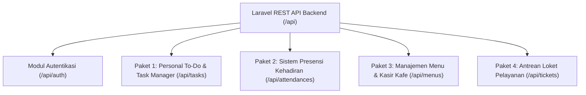
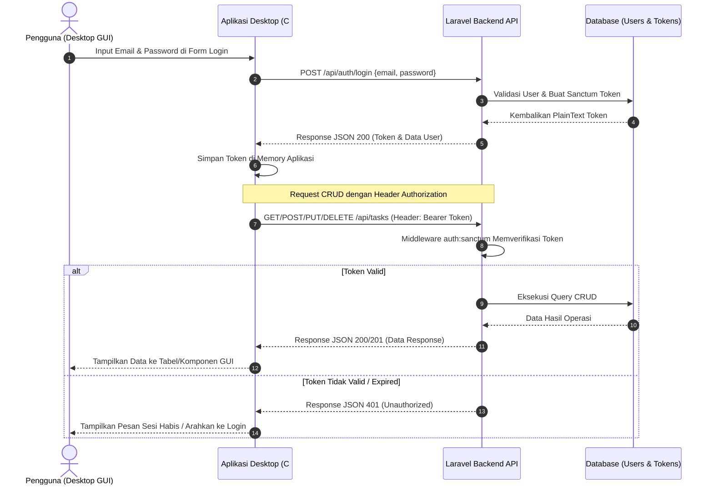

# Rencana Soal Pemrograman Desktop (CRUD REST API Laravel)

Dokumen ini memuat spesifikasi 4 paket soal ujian/tugas pemrograman desktop (Visual Basic / WPF) yang terhubung ke backend Laravel REST API, format response JSON serta mekanisme Keamanan Autentikasi & Otorisasi menggunakan Bearer Token (Laravel Sanctum).

## Ringkasan 4 Paket Soal



---

## Standar Format Response JSON API

Seluruh endpoint API mengembalikan format response JSON yang seragam:

### 1. Single Object Response (GET Detail / POST Create / PUT Update)
```json
{
  "code": 200,
  "status": "success",
  "body": {
    "id": 1,
    "name": "Contoh Data"
  }
}
```

### 2. Array / List Response (GET All / Pagination)
```json
{
  "code": 200,
  "status": "success",
  "body": [
    {
      "id": 1,
      "name": "Data 1"
    },
    {
      "id": 2,
      "name": "Data 2"
    }
  ],
  "page": {
    "size": 10,
    "totalPage": 1,
    "total": 2,
    "current": 1
  }
}
```

### 3. Error / Validation Response (400 Bad Request / 404 Not Found / 422 Unprocessable)
```json
{
  "code": 400,
  "status": "bad_request",
  "errors": {
    "title": [
      "must not be null"
    ],
    "status": [
      "must be one of: pending, in_progress, completed"
    ]
  }
}
```

### 4. Unauthenticated / Unauthorized Response (401 Unauthorized)
```json
{
  "code": 401,
  "status": "unauthorized",
  "errors": {
    "auth": [
      "Unauthenticated or invalid bearer token"
    ]
  }
}
```

---

## Arsitektur Keamanan: Autentikasi & Otorisasi Bearer Token (Laravel Sanctum)

Sistem menggunakan **Laravel Sanctum** untuk otentikasi berbasis token (*Personal Access Tokens*). Setiap pengguna/mahasiswa harus melakukan autentikasi untuk mendapatkan token sebelum dapat mengakses dan memanipulasi data CRUD.



### 1. Endpoint Autentikasi
| Method | URL Endpoint | Header | Request Body | Response Body |
|---|---|---|---|---|
| `POST` | `/api/auth/register` | `Accept: application/json` | `{ "name": "...", "email": "...", "password": "...", "password_confirmation": "..." }` | `code: 201, status: success, body: { user: {...}, token: "1\|abcdef..." }` |
| `POST` | `/api/auth/login` | `Accept: application/json` | `{ "email": "...", "password": "..." }` | `code: 200, status: success, body: { user: {...}, token: "2\|xyz123..." }` |
| `POST` | `/api/auth/logout` | `Authorization: Bearer <token>` | - | `code: 200, status: success, body: { message: "Logged out successfully" }` |
| `GET` | `/api/auth/me` | `Authorization: Bearer <token>` | - | `code: 200, status: success, body: { id: 1, name: "...", email: "..." }` |

### 2. Mekanisme Otorisasi pada Endpoint CRUD
Semua endpoint data (`/api/tasks`, `/api/attendances`, `/api/menus`, `/api/tickets`) dilindungi dengan middleware `auth:sanctum`.
- **Wajib Header pada setiap request**:
  ```http
  Authorization: Bearer <token_dari_login>
  Accept: application/json
  Content-Type: application/json
  ```
- **Contoh Implementasi Route Backend (`routes/api.php`)**:
  ```php
  // Public auth routes (dengan rate limit 5 req/menit)
  Route::prefix('auth')->middleware('throttle:5,1')->group(function () {
      Route::post('register', [AuthController::class, 'register']);
      Route::post('login',    [AuthController::class, 'login']);
  });

  // Protected API routes (dengan token sanctum & rate limit 60 req/menit)
  Route::middleware(['auth:sanctum', 'throttle:60,1'])->group(function () {
      Route::post('auth/logout', [AuthController::class, 'logout']);
      Route::get('auth/me',     [AuthController::class, 'me']);

      Route::apiResource('tasks', TaskController::class);
      Route::apiResource('attendances', AttendanceController::class);
      Route::apiResource('menus', MenuController::class);
      Route::apiResource('tickets', TicketController::class);
  });
  ```

### 3. Konfigurasi Masa Aktif Token (Expiration)
Diatur pada [config/sanctum.php](file:///C:/laragon/www/project-uts/config/sanctum.php) agar sesi ujian/praktikum memiliki batas waktu:
```php
'expiration' => 120, // Token kedaluwarsa setelah 120 menit
```

### 4. Panduan Implementasi di Aplikasi Desktop Client
- **Form Login GUI**: Buat form login awal (Email & Password).
- **Session State**: Simpan token yang diterima ke dalam variabel *in-memory* (contoh: class `SessionManager` / `AuthService`).
- **HTTP Header Attachment**: Pasang `DefaultRequestHeaders.Authorization` (C#) atau header builder (Java/Python) pada setiap request HTTP.
- **Handling 401**: Jika API mengembalikan `code: 401`, aplikasi desktop otomatis membuka kembali jendela Login.

---

---

## Paket 1: Personal To-Do & Task Manager

### Deskripsi Kasus
Aplikasi desktop untuk mencatat, mengorganisir, dan mengelola daftar tugas kuliah/pribadi.

### Struktur Data (Tabel `tasks`)
| Field | Tipe Data | Keterangan |
|---|---|---|
| `id` | BigInt (PK) | Auto increment |
| `title` | Varchar(255) | Judul tugas (wajib) |
| `description` | Text (Nullable) | Keterangan/deskripsi tugas |
| `category` | Varchar(100) | Kategori (Kuliah, Pribadi, Pekerjaan) |
| `status` | Enum | `pending`, `in_progress`, `completed` (default: `pending`) |
| `due_date` | Date (Nullable) | Tenggat waktu (`DD-MM-YYYY`, contoh: `15-09-2026`) |
| `created_at` / `updated_at` | Timestamps | Waktu pembuatan & pembaruan |

### Endpoint REST API (Terproteksi Bearer Token)
| Method | URL Endpoint | Request Body | Response Success |
|---|---|---|---|
| `GET` | `/api/tasks` | - | `code: 200, status: success, body: [...], page: {...}` |
| `POST` | `/api/tasks` | `{ "title": "...", "description": "...", "category": "...", "status": "pending", "due_date": "15-09-2026" }` | `code: 201, status: success, body: { id: 1, ... }` |
| `GET` | `/api/tasks/{id}` | - | `code: 200, status: success, body: { id: 1, ... }` |
| `PUT` | `/api/tasks/{id}` | `{ "title": "...", "status": "completed", ... }` | `code: 200, status: success, body: { id: 1, ... }` |
| `DELETE` | `/api/tasks/{id}` | - | `code: 200, status: success, body: { "message": "Task deleted successfully" }` |

### Spesifikasi GUI & Alur CRUD Desktop
1. **Login & Auth**: Form login awal untuk memperoleh Bearer Token.
2. **Create**: Form input tugas (Judul, Deskripsi, Kategori [ComboBox], Deadline [DateTimePicker]).
3. **Read**: DataGridView / JTable / QTableWidget menampilkan daftar tugas.
4. **Update**: Memilih tugas di tabel untuk diedit nilainya atau klik tombol "Mark as Completed".
5. **Delete**: Menghapus tugas dengan dialog konfirmasi (*MessageBox Confirm*).

---

## Paket 2: Sistem Presensi & Kehadiran Mahasiswa/Karyawan

### Deskripsi Kasus
Aplikasi desktop pencatatan kehadiran presensi di meja resepsionis atau laboratorium.

### Struktur Data (Tabel `attendances`)
| Field | Tipe Data | Keterangan |
|---|---|---|
| `id` | BigInt (PK) | Auto increment |
| `nim` | Varchar(50) | NIM / No. Identitas (wajib) |
| `student_name` | Varchar(150) | Nama lengkap (wajib) |
| `date` | Date | Tanggal presensi (`DD-MM-YYYY`, contoh: `10-09-2026`) |
| `time_in` | Time | Jam masuk (`HH:mm:ss`) |
| `time_out` | Time (Nullable) | Jam pulang (`HH:mm:ss`) |
| `status` | Enum | `Hadir`, `Izin`, `Sakit`, `Alpha` |
| `note` | Varchar(255) (Nullable) | Keterangan/catatan |
| `created_at` / `updated_at` | Timestamps | Waktu pembuatan & pembaruan |

### Endpoint REST API (Terproteksi Bearer Token)
| Method | URL Endpoint | Request Body | Response Success |
|---|---|---|---|
| `GET` | `/api/attendances` | - | `code: 200, status: success, body: [...], page: {...}` |
| `POST` | `/api/attendances` | `{ "nim": "...", "student_name": "...", "date": "10-09-2026", "time_in": "08:00:00", "status": "Hadir", "note": "..." }` | `code: 201, status: success, body: { id: 1, ... }` |
| `GET` | `/api/attendances/{id}` | - | `code: 200, status: success, body: { id: 1, ... }` |
| `PUT` | `/api/attendances/{id}` | `{ "time_out": "17:00:00", "status": "Hadir", ... }` | `code: 200, status: success, body: { id: 1, ... }` |
| `DELETE` | `/api/attendances/{id}` | - | `code: 200, status: success, body: { "message": "Attendance record deleted successfully" }` |

### Spesifikasi GUI & Alur CRUD Desktop
1. **Login & Auth**: Form login petugas presensi.
2. **Create**: Form input absensi masuk baru (NIM, Nama, Status [Radio/ComboBox], Jam Masuk).
3. **Read**: Tabel rekap presensi harian dengan filter tanggal dan pencarian NIM.
4. **Update**: Memilih baris data untuk input jam pulang (*Check-out*) atau revisi status kehadiran.
5. **Delete**: Menghapus data presensi yang salah input dengan konfirmasi.

---

## Paket 3: Sistem Kasir & Manajemen Menu Kafe (Cafe POS & Menu)

### Deskripsi Kasus
Aplikasi desktop kasir/admin kafe untuk mengelola katalog menu makanan/minuman, stok, dan harga jual.

### Struktur Data (Tabel `menus`)
| Field | Tipe Data | Keterangan |
|---|---|---|
| `id` | BigInt (PK) | Auto increment |
| `name` | Varchar(150) | Nama menu (wajib) |
| `category` | Enum | `Coffee`, `Non-Coffee`, `Snack`, `Main Course` |
| `price` | Decimal(12,2) | Harga jual menu |
| `stock` | Integer | Jumlah stok tersedia (default: 0) |
| `is_available` | Boolean | Ketersediaan menu (default: true) |
| `description` | Text (Nullable) | Deskripsi menu |
| `created_at` / `updated_at` | Timestamps | Waktu pembuatan & pembaruan |

### Endpoint REST API (Terproteksi Bearer Token)
| Method | URL Endpoint | Request Body | Response Success |
|---|---|---|---|
| `GET` | `/api/menus` | - | `code: 200, status: success, body: [...], page: {...}` |
| `POST` | `/api/menus` | `{ "name": "...", "category": "Coffee", "price": 25000, "stock": 50, "is_available": true, "description": "..." }` | `code: 201, status: success, body: { id: 1, ... }` |
| `GET` | `/api/menus/{id}` | - | `code: 200, status: success, body: { id: 1, ... }` |
| `PUT` | `/api/menus/{id}` | `{ "price": 28000, "stock": 45, "is_available": true }` | `code: 200, status: success, body: { id: 1, ... }` |
| `DELETE` | `/api/menus/{id}` | - | `code: 200, status: success, body: { "message": "Menu item deleted successfully" }` |

### Spesifikasi GUI & Alur CRUD Desktop
1. **Login & Auth**: Form login kasir/admin kafe.
2. **Create**: Form tambah menu baru (Nama, Kategori [ComboBox], Harga, Stok awal, Checkbox Tersedia).
3. **Read**: Grid/Tabel katalog menu dengan fitur search filter berdasarkan nama & kategori.
4. **Update**: Form edit untuk memperbarui harga atau stok, atau tombol cepat ubah status ketersediaan (*Toggle*).
5. **Delete**: Menghapus menu yang sudah tidak dijual dari sistem.

---

## Paket 4: Sistem Antrean Loket Pelayanan & Helpdesk Tiket

### Deskripsi Kasus
Aplikasi desktop loket pelayanan untuk mengelola pengambilan nomor antrean dan pemanggilan status layanan pelanggan.

### Struktur Data (Tabel `tickets`)
| Field | Tipe Data | Keterangan |
|---|---|---|
| `id` | BigInt (PK) | Auto increment |
| `ticket_number` | Varchar(20) | Nomor tiket antrean (contoh: `A-001`) |
| `customer_name` | Varchar(150) | Nama pengunjung/pelanggan |
| `service_type` | Enum | `Customer Service`, `Teller`, `Helpdesk` |
| `status` | Enum | `Menunggu`, `Dipanggil`, `Selesai`, `Batal` |
| `counter_number` | Varchar(10) (Nullable) | Nomor loket (contoh: `Loket 1`) |
| `notes` | Text (Nullable) | Catatan pelayanan/kendala |
| `created_at` / `updated_at` | Timestamps | Waktu pembuatan & pembaruan |

### Endpoint REST API (Terproteksi Bearer Token)
| Method | URL Endpoint | Request Body | Response Success |
|---|---|---|---|
| `GET` | `/api/tickets` | - | `code: 200, status: success, body: [...], page: {...}` |
| `POST` | `/api/tickets` | `{ "ticket_number": "A-001", "customer_name": "...", "service_type": "Customer Service", "status": "Menunggu" }` | `code: 201, status: success, body: { id: 1, ... }` |
| `GET` | `/api/tickets/{id}` | - | `code: 200, status: success, body: { id: 1, ... }` |
| `PUT` | `/api/tickets/{id}` | `{ "counter_number": "Loket 1", "status": "Dipanggil", "notes": "..." }` | `code: 200, status: success, body: { id: 1, ... }` |
| `DELETE` | `/api/tickets/{id}` | - | `code: 200, status: success, body: { "message": "Ticket deleted successfully" }` |

### Spesifikasi GUI & Alur CRUD Desktop
1. **Login & Auth**: Form login petugas loket/customer service.
2. **Create**: Form input / cetak nomor antrean baru (Nomor Tiket, Nama, Jenis Layanan).
3. **Read**: Tabel antrean aktif yang menampilkan status `Menunggu` dan `Dipanggil`.
4. **Update**: Tombol "Panggil Antrean" (mengisi nomor loket & ubah status ke `Dipanggil`) dan tombol "Selesai".
5. **Delete**: Menghapus / membatalkan nomor antrean jika pelanggan tidak hadir.

---

## Rubrik Penilaian Standar Pemrograman Desktop

| No | Komponen Penilaian | Bobot | Deskripsi |
|---|---|---|---|
| 1 | **Autentikasi & Login (Sanctum Token)** | 15% | Form login berhasil melakukan request ke `/api/auth/login`, menerima Bearer Token, menyimpannya di memory state aplikasi, serta menangani error 401. |
| 2 | **Koneksi API & READ (Tabel GUI)** | 20% | Mengirim request `GET` dengan header `Authorization: Bearer <token>`, mem-parsing JSON response (`body` & `page`), lalu merender ke DataGridView/JTable/QTableWidget. |
| 3 | **Form Input & CREATE** | 20% | Form input mengirim payload JSON via `POST` ber-token dan menerima respon `code: 201` atau menampilkan pesan error validasi. |
| 4 | **Fitur UPDATE** | 20% | Mengambil baris terpilih ke form edit, lalu mengirim request `PUT` ber-token untuk memperbarui data di backend. |
| 5 | **Fitur DELETE** | 15% | Mengirim request `DELETE` ber-token ke backend dengan dialog konfirmasi sebelum data dihapus. |
| 6 | **UI/UX & Error Handling** | 10% | Validasi form kosong pada GUI, penanganan saat API offline/down, feedback pesan sukses, dan tombol Logout. |
